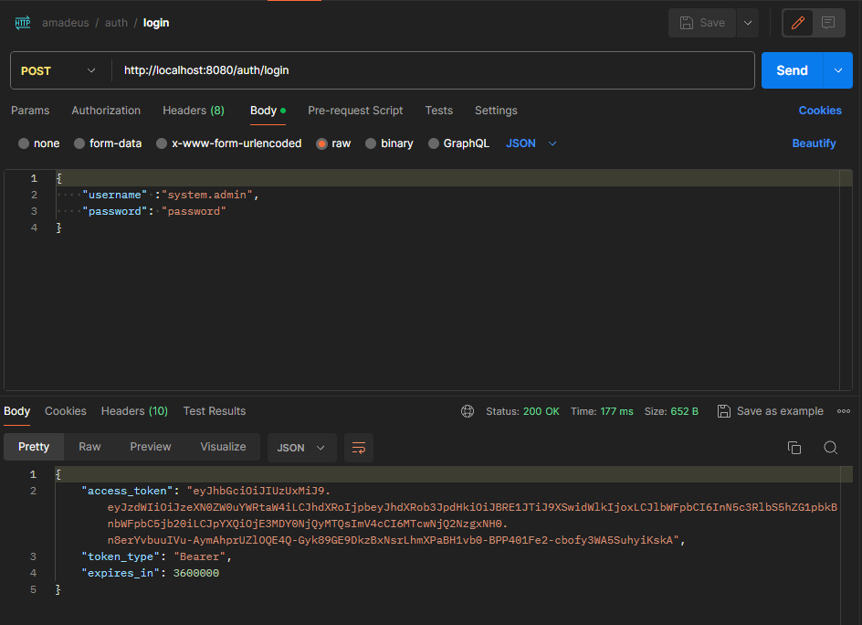
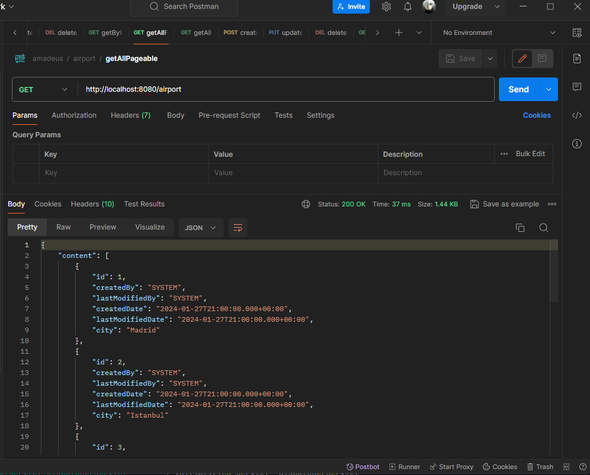
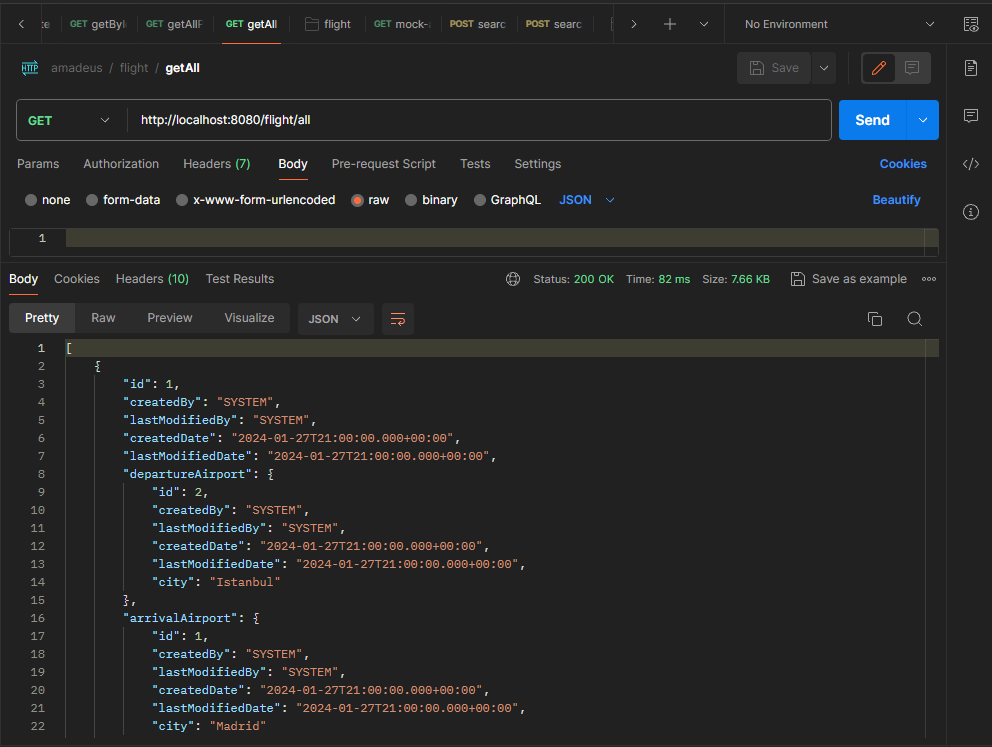
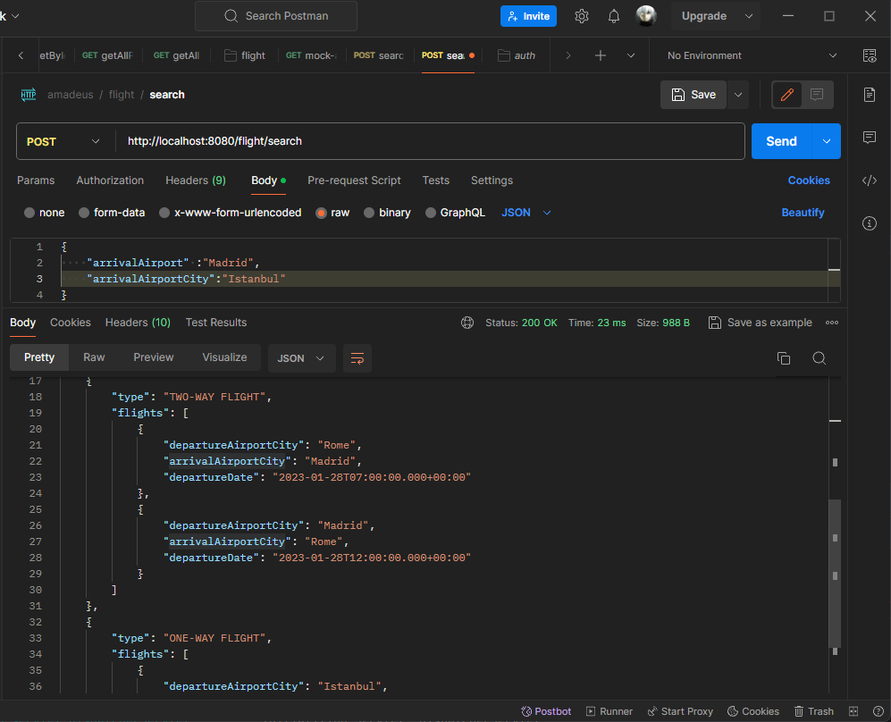
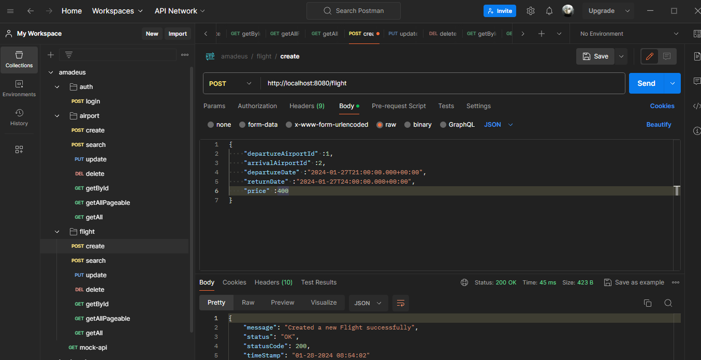
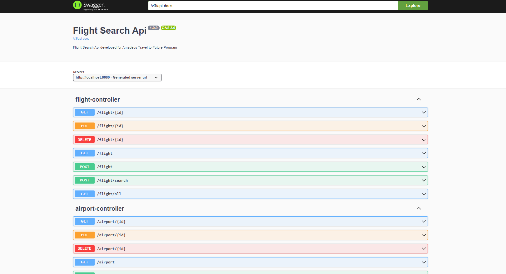

<a name="readme-top"></a>
<br />
<div align="center">

  <h3 align="center">Flight Search Api</h3>

</div>

<details>
  <summary>Table of Contents</summary>
  <ol>
    <li>
      <a href="#about-the-project">About The Project</a>
      <ul>
        <li><a href="#security">Security</a></li>
        <li><a href="#built-with">Built With</a></li>
      </ul>
    </li>
    <li>
      <a href="#getting-started">Getting Started</a>
      <ul>
        <li><a href="#prerequisites">Prerequisites</a></li>
        <li><a href="#installation">Installation</a></li>
      </ul>
    </li>
    <li><a href="#usage">Usage</a></li>
    <li><a href="#swagger-docs">Swagger Docs</a></li>
    <li><a href="#license">License</a></li>
    <li><a href="#contact">Contact</a></li>
  </ol>
</details>

## About The Project

Flight Search Api developed for Amadeus Travel to Future Program.
A relational Database is used in this project. Postgresql is the selected database. Before starting the application, first run the docker-compose.yml to start database server on docker container. <br>
<br>
DATABASE CREDENTIALS: <br>
Username: admin<br>
Password: admin<br>
<br>
Navigate to http://localhost:5050/browser/ to access PG_ADMIN
PG_ADMIN CREDENTIALS <br>
Username: admin@admin.com <br>
Password: admin <br>

MapStruct is used to map DTOs to entities and nice versa. <br>
Lombok is used for removing boiler-plate code <br>
Exception Handling is done <br>
Auditing information is avaliable in entities.<br>
QueryDsl is used for extended search on flights integrated with JPA repository <br>


<p align="right">(<a href="#readme-top">back to top</a>)</p>

### Security

System security is done via JWT Bearer tokens. Before doing any operation, user should obtain an token like following:

After that, pass this token with 'Bearer ' prefix to Authorization header on each request. Role based authantication is provided but all the api urls are accessible by any role. You can change it from security config and api urls if needed.
<p align="right">(<a href="#readme-top">back to top</a>)</p>


### Built With
- [![Spring][Spring]][Spring-url]

- 

- 
<p align="right">(<a href="#readme-top">back to top</a>)</p>

## Getting Started

### Prerequisites

- java 17+
- docker
### Installation
Clone the repository
   ```sh
   git clone https://github.com/numankaf/amadeus-flight-api.git
   ```

For backend:
1. Go to Directory
    ```sh
    cd flightsearchapi
   ```
2. Run Docker Containers 
   ```sh
   docker-compose up -d
   ```
3. Install Dependicies
   ```sh
   mvn clean install
   ```
   
4. Run the application
   ```sh
   mvn spring-boot:run
   ```

<p align="right">(<a href="#readme-top">back to top</a>)</p>

## Usage







## Swagger Docs
Navigate to http://localhost:8080/swagger-ui/index.html to see the Swagger docs.



## License

Distributed under the Apache-2.0 License. See `LICENSE.txt` for more information.

<p align="right">(<a href="#readme-top">back to top</a>)</p>

## Contact

Numan Kafadar - numankafadar97@gmail.com

Project Link: [https://github.com/numankaf/ICESHU4](https://github.com/numankaf/ICESHU4)

<p align="right">(<a href="#readme-top">back to top</a>)</p>


[contributors-shield]: https://img.shields.io/github/contributors/numankaf/ICESHU4.svg?style=for-the-badge
[contributors-url]: https://github.com/numankaf/ICESHU4/graphs/contributors
[forks-shield]: https://img.shields.io/github/forks/numankaf/ICESHU4.svg?style=for-the-badge
[forks-url]: https://github.com/numankaf/ICESHU4/network/members
[stars-shield]: https://img.shields.io/github/stars/numankaf/ICESHU4.svg?style=for-the-badge
[stars-url]: https://github.com/numankaf/ICESHU4/stargazers
[issues-shield]: https://img.shields.io/github/issues/numankaf/ICESHU4.svg?style=for-the-badge
[issues-url]: https://github.com/numankaf/ICESHU4/issues
[license-shield]: https://img.shields.io/github/license/numankaf/pokedex.svg?style=for-the-badge
[license-url]: https://github.com/numankaf/ICESHU4/blob/main/LICENSE
[linkedin-shield]: https://img.shields.io/badge/-LinkedIn-black.svg?style=for-the-badge&logo=linkedin&colorB=555
[linkedin-url]: https://www.linkedin.com/in/numan-kafadar-5b05bb22a/

[Spring]: https://img.shields.io/badge/Spring-6DB33F?style=for-the-badge&logo=spring&logoColor=white
[Spring-url]: https://spring.io/